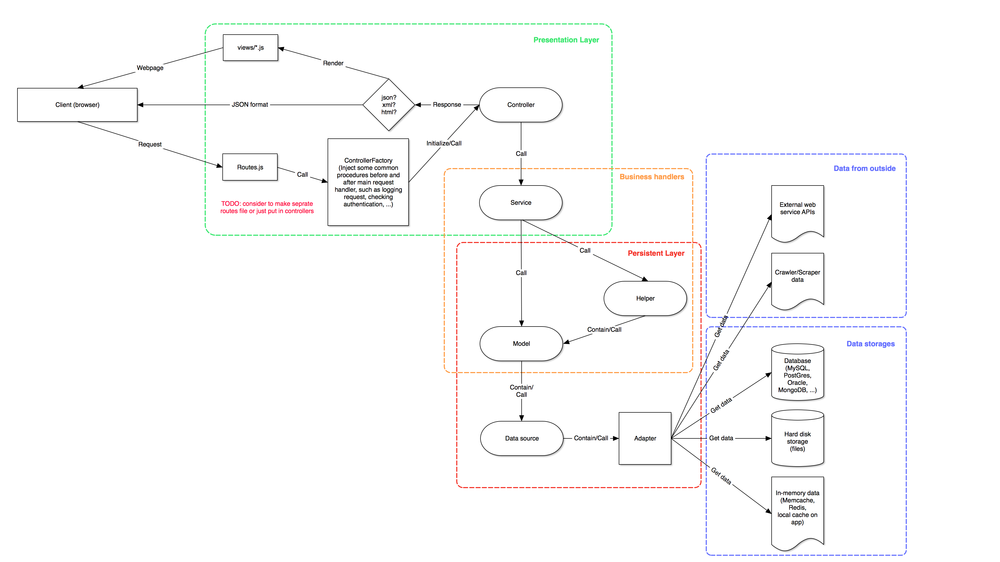

# Sota Framework for NodeJS server
## 1.Structure overview


## 2.Folders organization
#### 2.1.Permanent files and folders
```
app/ 				# Here come the business stuffs of our app
  controllers/ 		# Don't need to explain this obvious things...
  models/
  services/
  Main.js 			# Initializer script of the app
boot/ 				# Scripts to start app as a daemon
config/
  Config.js 		# Should be a symlink to one of following config files
  Config_Dev.js 	# Config for development enviroment
  Config_Prod.js 	# Config for production enviroment
  ...
  Config_Clgt.js 	# We may have various environments though
  Routes.js 		#
core/ 				# Core of Sota framework
public/ 			# Here come static files
views/ 				# Enough obvious as well
```
#### 2.2.Optional files and folders
```
helpers/ 			# Place multi-model handlers here (contain business/logic)
libs/ 				# Sometimes we need to use external libs, put them here
utils/ 				# For common, static handlers (just deal with primitive data)
```

## 3.Code APIs
#### BaseClass
- `initialize($super, params)`
- `extend(superclass, interfaces)`

#### ControllerFactory
- `create(func)`
- `createNoAuth(func)`
- `authenticate(req, res, callback)`
...

```
// TODO: determine put all handled path in routing files,
// or separate in each controller
```

#### BaseController
```
// TODO: create sample files
```

#### BaseService
```
// Almost no common things
// Handle business for particular application
```

#### BaseModel
- `initialize($super, dataSource, adapter)`
- `createTable(callback)`
- `find(options, callback)`
- `findOne(options, callback)`
- `findById(options, callback)`
- `insert(entity, callback)`
- `insert(entities, callback)`
- `update(entity, callback)`
- `update(options, callback)`
- `delete(entity, callback)`
- `delete(entities, callback)`
- `delete(options, callback)`
- `beginTransaction(callback)`
- `commit(callback)`
- `rollback(callback)`
- `exec(sql, options, callback)`

#### BaseEntity
- `initialize($super, model)`
- `save(callback)`
- `beforeSave($super, callback)`
- `afterSave($super, callback)`
- `delete(callback)`
- `beforeDelete($super, callback)`
- `afterDelete($super, callback)`
- `reload(callback)`

```
TODO: Determine whether we need this class...
```
#### BaseAdapter
- `initialize($super, config)`
- `select(options, callback)`
- `insertOne(entity, callback)`
- `insertBatch(entities, callback)`
- `updateOne(entity, callback)`
- `updateBatch(options, callback)`
- `deleteOne(entity, callback)`
- `deleteBatch(options, callback)`

## 4.Sample code
```
TODO: add sample code
```

## 5.Backlog - TBD
- WRITE UNIT-TESTS
- Standard/expandable user table
- Session info/Authentication
- Processes pooling/management
- Failure handling
- Database connection pooling/management
- Handle hookers
